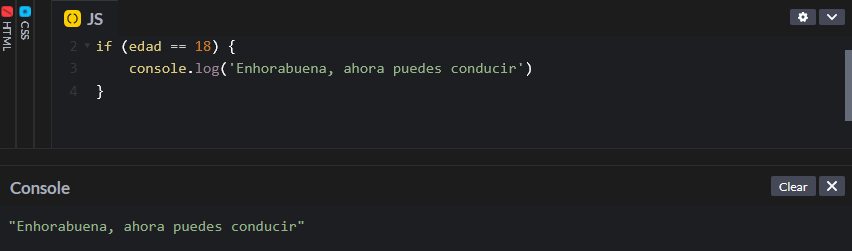
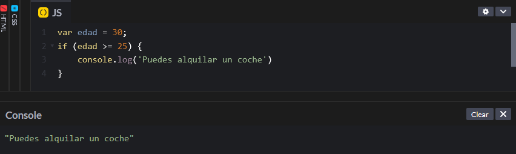
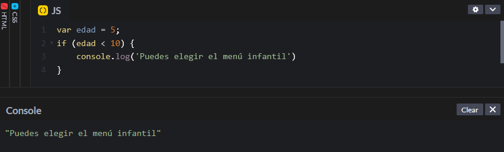
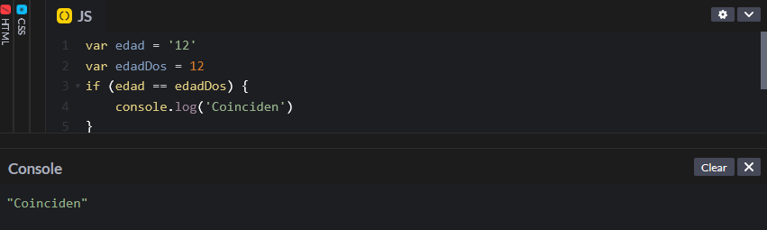
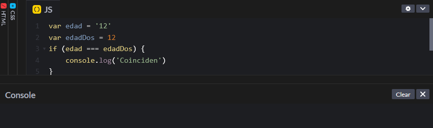
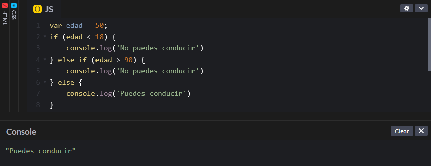
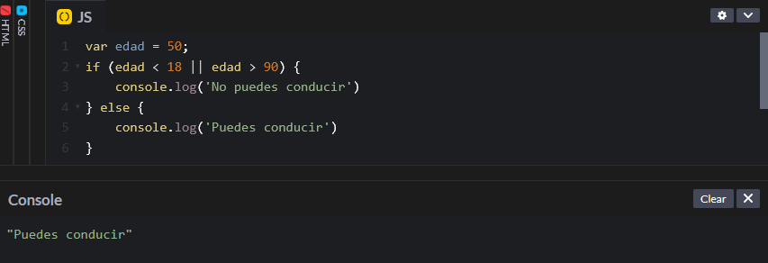
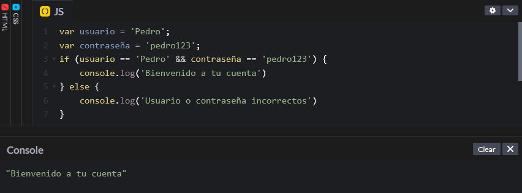
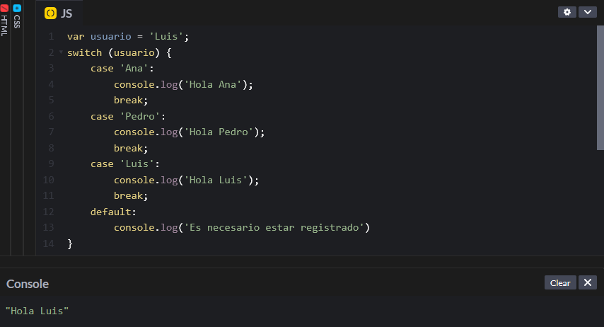

# Condicionales

Las declaraciones condicionales permiten ejecutar el código si se cumplen una serie de requisitos o condiciones. Este tipo de declaraciones permiten realizar un programa dinámico y que tome decisiones en función de la situación. La forma en la que se escribe una declaración condicional es mediante la palabra clave `if` seguido de la condición. La sangría es importante, ya que, si no se aplica daría lugar a errores. En JavaScript las condiciones se escriben de la siguiente forma:

```javascript
var edad = 18;
if (edad == 18) {
    console.log('Enhorabuena, ahora puedes conducir')
}
```

Como se puede observar la condición se escribe entre paréntesis `()` y el resultado entre corchetes `{}`. Además, en la condición de igualdad se escriben dos signos de igual `==`, ya que si solo se escribe uno estamos asignando un valor a la variable.&#x20;

<figure><figcaption></figcaption></figure>

Como la edad es igual a 18, devuelve 'Enhorabuena, ahora puedes conducir'.

### Operadores condicionales

A parte de la igualdad `==`  las condiciones también pueden comparar si un valor es mayor, menor o diferente a otro. Para ello se utilizan los siguientes operadores:

* Mayor que: >
* Mayor o igual que: >=
* Menor que: <
* Menor o igual que: <=
* Desigualdad o diferencia: !=
* Igualdad estricta: ===
* Desigualdad estricta: !==

Vamos a ver algunos ejemplos combinando los operadores con diferentes tipos de datos.&#x20;

```javascript
var edad = 30;
if (edad >= 25) {
    console.log('Puedes alquilar un coche')
}
```

<figure><figcaption></figcaption></figure>

Como la edad es mayor o igual que 25, devuelve 'Puedes alquilar un coche'.

El operador < sigue la misma dinámica:&#x20;

```javascript
var edad = 5;
if (edad < 10) {
    console.log('Puedes elegir el menú infantil')
}
```

<figure><figcaption></figcaption></figure>

En este caso, la edad es menor de 10, por lo que puede elegir el menú infantil.&#x20;

Ahora vamos a ver la diferencia entre la igualdad y la igualdad estricta.&#x20;

```javascript
var edad = '12'
var edadDos = 12
if (edad == edadDos) {
    console.log('Coinciden')
}
```

En este caso tenemos una variable edad que contiene una cadena y una variable edadDos que contiene un número. En esencia ambas variables contiene el mismo dato, por lo que si las comparamos con una igualdad normal el resultado será que coinciden.&#x20;

<figure><figcaption></figcaption></figure>

Sin embargo, sabemos que no son estrictamente iguales, ya que una variable es una cadena, mientras que la otra es un número. Por tanto, si las comparamos estrictamente,&#x20;

```javascript
var edad = '12'
var edadDos = 12
if (edad === edadDos) {
    console.log('Coinciden')
}
```

<figure><figcaption></figcaption></figure>

Podemos observar que no devuelve nada porque no se cumple que sean estrictamente iguales y no hay otra condición en caso de que no se cumpla la primera.

### else if y else

En las declaraciones condicionales se pueden escribir múltiples condiciones, de forma que si no se cumple una pase a la siguiente. Para ello se utilizan las palabras clave `else if`, para añadir otra condición, y `else`, que incluye todas las condiciones que no se hayan especificado.&#x20;

```javascript
var edad = 50;
if (edad < 18) {
    console.log('No puedes conducir')
} else if (edad > 90) {
    console.log('No puedes conducir')
} else {
    console.log('Puedes conducir')
}
```

<figure><figcaption></figcaption></figure>

En el ejemplo anterior, revisa si la edad es menor de 18 años, como no se cumple pasa a la siguiente condición, que es mirar si es mayor de 90 años. Como tampoco se cumple, finalmente devuelve 'Puedes conducir'.

### Condicionales compuestas

Una declaración condicional puede contener más de una condición en una sola línea de código. Para ello se utilizan los operadores and `&&` y or `||`. Por ejemplo, si reescribimos el ejemplo anterior utilizando una declaración condicional compuesta quedaría así:

```javascript
var edad = 50;
if (edad < 18 || edad > 90) {
    console.log('No puedes conducir')
} else {
    console.log('Puedes conducir')
}
```

<figure><figcaption></figcaption></figure>

De esta forma el resultado es el mismo, pero se ahorran dos líneas de código.&#x20;

Veamos un ejemplo con el operador and,

```javascript
var usuario = 'Pedro';
var contraseña = 'pedro123';
if (usuario == 'Pedro' && contraseña == 'pedro123') {
    console.log('Bienvenido a tu cuenta')
} else {
    console.log('Usuario o contraseña incorrectos')
}
```

<figure><figcaption></figcaption></figure>

Como tanto el usuario como la contraseña son correctos, podemos acceder a la cuenta.&#x20;

### Operador switch

Switch se utiliza cuando hay varias opciones y queremos contemplarlas todas. En función del caso evaluado se busca el correspondiente y devuelve un resultado. Por ejemplo, si en nuestra aplicación hay 3 usuarios registrados: Ana, Pedro y Luis. Podemos generar un switch case en el que evalúe si el nombre del usuario que se quiere registrar coincide con Ana, Pedro o Luis y, si coincide, les devuelva un saludo y, si no coincide pida que se registre.

```javascript
var usuario = 'Luis';
switch (usuario) {
    case 'Ana':
        console.log('Hola Ana');
        break;
    case 'Pedro':
        console.log('Hola Pedro');
        break;
    case 'Luis':
        console.log('Hola Luis');
        break;
    default:
        console.log('Es necesario estar registrado')
}
```

<figure><figcaption></figcaption></figure>

Como se puede observar a `switch` hay que pasarle una variable entre paréntesis, en este caso usuario. Y luego para cada caso (Ana, Pedro y Luis) devuelve una cadena diferente. De esta forma, como el usuario es Luis, el programa va pasando los casos y cuando llega a Luis imprime la frase 'Hola Luis' y se detiene. La orden de detención la da la palabra `break`, de lo contrario el programa ejecutaría también la opción por defecto 'Es necesario estar registrado'.
