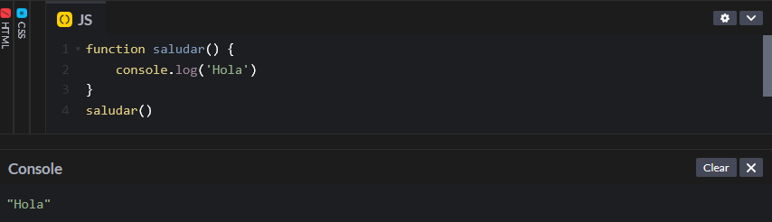
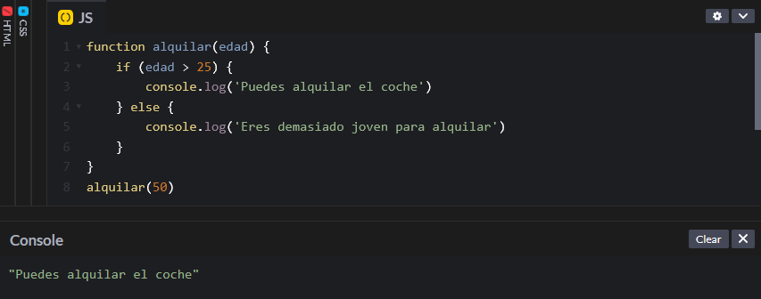
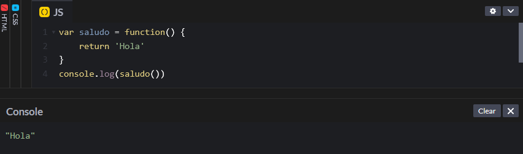

# Declaración de función vs. expresión de función

Las funciones son bloques de construcción que contienen un conjunto de instrucciones para realizar una tarea. Las funciones tienen uno o varios valores de entrada, que con los argumentos, y un valor de salida en el que se devuelve la ejecución de las instrucciones. La forma en la que se escribe una función en JavaScript es la siguiente:

```javascript
function saludar() {
    console.log('Hola')
}
saludar()
```

Se escribe la palabra `function` seguida del nombre de la función y paréntesis. Entre los paréntesis se añadirían los argumentos en caso de haberlos, pero también se puede crear una función sin argumentos. Después entre paréntesis hay que escribir el código que queremos que se ejecute al llamar a la función, que en este caso es `'Hola'`.

<figure><figcaption></figcaption></figure>

Como se puede observar, para ejecutar la función es necesario llamarla (`saludar()`).&#x20;

Además de esa función simple vamos a crear otra función más compleja que contenga argumentos.

```javascript
function alquilar(edad) {
    if (edad > 25) {
        console.log('Puedes alquilar el coche')
    } else {
        console.log('Eres demasiado joven para alquilar')
    }
}
alquilar(50)
```

En este caso ya estamos pasando un argumento, que es la edad. Como se puede observar ya no es necesario declarar la variable antes de la función, sino que, al llamar a la función, se pasa directamente como argumento (`alquilar(50)`).

<figure><figcaption></figcaption></figure>

Como la edad es de 50 años, puedo alquilar el coche.

Esto que hemos creado hasta ahora son declaraciones de función, ya que estamos declarando la función directamente con la palabra `function`. Sin embargo, hay otra forma de crear funciones que es lo que se conoce como expresión de función. La forma en la que se crea es la siguiente:

```javascript
var saludo = function() {
    return 'Hola';
}
console.log(saludo())
```

En este caso lo que estamos creando en realidad es una variable que contiene una función anónima, es decir, sin nombre. Por tanto, a la hora de ejecutar el código de la función no vale solo con llamar a la función y pasar los argumentos, sino que hay que escribir `console.log()`.

<figure><figcaption></figcaption></figure>

En realidad para funciones sencillas como la de arriba no importa si se utiliza una declaración de función o una expresión de función ya que, como hemos visto, el resultado en ambos casos es igual. Sin embargo, veamos lo que pasa a la hora de anidar las funciones en otros bloques como loops o condicionales.

```javascript
var edad = 50
if (edad > 25) {
    function alquilar() {
        return 'Puedes alquilar el coche'
    }
    var alquilarDos = function(){
        return 'Con esta función también puedes alquilar el coche'
    }
}
```

<figure><figcaption></figcaption></figure>

Como se puede observar, ambas funciones muestran el resultado, pero si analizamos el script veremos que la primera función (declaración de función) la marca en rojo, mientras que la segunda (expresión de función) la marca como correcta. Lo que ocurre es que las declaraciones de funciones no deben colocarse en bloques, es decir, si necesitamos una función dentro de un bucle o un condicional debemos de utilizar las expresiones de función.
