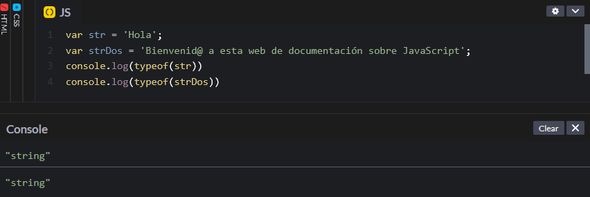
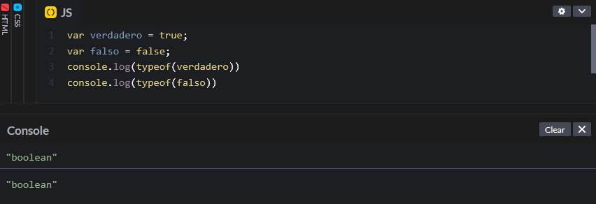
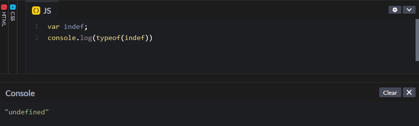
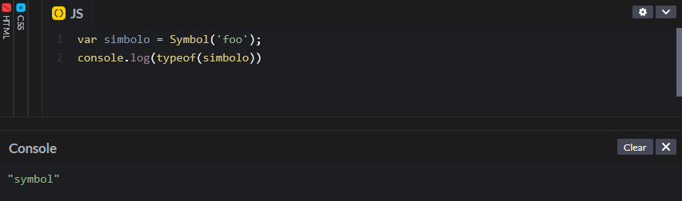

# Tipos de datos

JavaScript trabaja con 6 tipos de datos, principalmente, que son los números, cadenas, booleanos, nulo, indefinidos y símbolos.

### Números

El tipo de datos numérico contienen números, que pueden ser enteros o decimales.&#x20;

```javascript
var num = 3;
var numDos = 3.5;
```

Una forma de observar el tipo de datos que tenemos es mediante el operador `typeof` .

<figure><figcaption></figcaption></figure>

### Cadenas

Las cadenas o strings pueden contener una única palabra o pueden estar formadas por una frase.

```javascript
var str = 'Hola';
var strDos = 'Bienvenid@ a esta web de documentación sobre JavaScript';
```

<figure><figcaption></figcaption></figure>

### Booleanos

Los datos booleanos contienen dos valores: verdadero (`true`) o falso (`false`).

```javascript
var verdadero = true;
var falso = false;
```

<figure><figcaption></figcaption></figure>

### Nulo

Una variable nula está definida, ya que contiene el valor `null`, pero está vacía. Esto permite diferenciar entre una variable indefinida y una variable vacía. Es posible que nos olvidemos de escribir los datos en una variable, lo cual puede dar lugar a errores, o puede que nos interese que esa variable esté vacía, para lo cual se utiliza el valor nulo.

```javascript
var nulo = null;
```

### Indefinidos

Las variables indefinidas son aquellas que no tienen datos en su interior. Hay que tener cuidado con el uso intencionado de este tipo de datos porque puede dar lugar a errores.

```javascript
var indef;
```

<figure><figcaption></figcaption></figure>

### Símbolos

Los símbolos son datos únicos e inmutables, por lo que una vez creados no se podrá cambiar su contenido. Se utilizan para garantizar que un determinado objeto tenga un identificador único. &#x20;

```javascript
var simbolo = Symbol();
```

<figure><figcaption></figcaption></figure>
