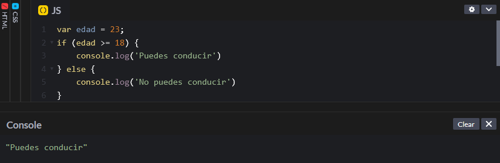
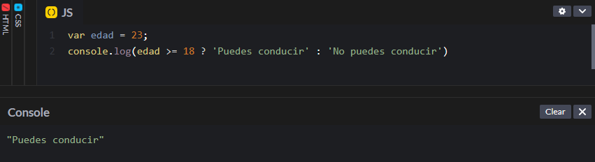

# Operador ternario

El operador ternario es otra forma de escribir las declaraciones condicionales, de forma que se pueden escribir en una sola línea, ahorrando líneas de código. Es recomendable utilizarlo en el caso de declaraciones sencillas. En código siguiente:

```javascript
var edad = 18;
if (edad >= 18) {
    console.log('Puedes conducir')
} else {
    console.log('No puedes conducir')
```

<figure><figcaption></figcaption></figure>

Da el mismo resultado que:

```javascript
var edad = 23;
console.log(edad >= 18 ? 'Puedes conducir' : 'No puedes conducir')
```

<figure><figcaption></figcaption></figure>

Para escribir la condición utilizando el operador ternario, primero se pasa la condición, en este caso `edad ≥ 18`, seguido de un símbolo de interrogación `?`. Luego se pasa el resultado que queremos obtener en caso de que se cumpla la condición `'Puedes conducir'`, seguido de dos puntos `:`. Por último, se pasa lo que en una condicional normal sería el `else`, es decir, `'No puedes conducir'`.
