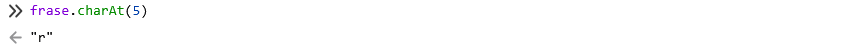
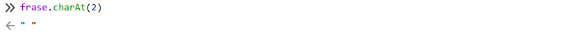
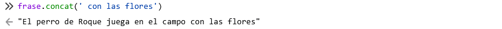
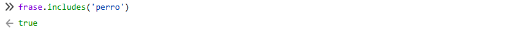
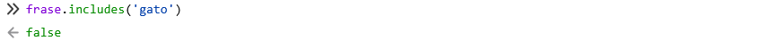
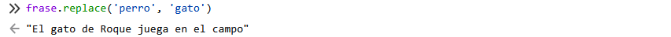
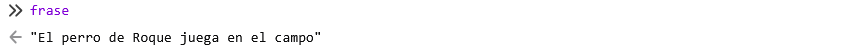
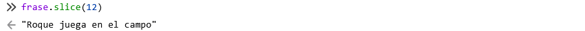
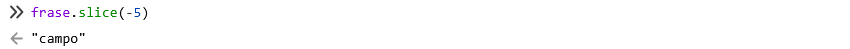
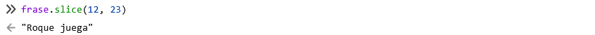

# Funciones de String

Las variables del tipo cadena o string tienen numerosas funciones que permiten modificar, obtener, añadir y eliminar su contenido. Cuando se modifica una cadena, en realidad la variable original no se modifica, por lo que a no ser que guarde esta nueva cadena en una nueva variable, no se guardan los cambios. Algunas de las funciones de string son charAt(), concat(), includes(), startsWith(), endsWith(9), repeat(), match(), replace(), indexOf(), lastIndecOf(), slice(), toUpperCase() y toLowerCase(). A partir del ejemplo inferior vamos a ir ejecutando algunas de esas funciones en la consola del navegador.&#x20;

```javascript
var frase = 'El perro de Roque juega en el campo';
```

### charAt()

La función `charAt()` permite determinar cual es el carácter que se encuentra en una posición determinada que pasamos a la función en los paréntesis.&#x20;

```javascript
frase.chatAt(5)
```

<figure><figcaption></figcaption></figure>

Como se puede observar devuelve la letra 'r', que es el carácter 5 teniendo en cuenta que empieza a contar desde 0. Si le pedimos que nos devuelva lo que hay en el carácter 2, podemos ver que devuelve una cadena vacía, ya que el carácter 2 es un espacio. Por tanto, esta función no solo tiene en cuenta las letras, sino los espacios también.&#x20;

<figure><figcaption></figcaption></figure>

### concat()

Esta función permite concatenar cadenas. Por ejemplo, si queremos añadir otra frase a la frase de ejemplo,

```javascript
frase.concat(' con las flores)
```

<figure><figcaption></figcaption></figure>

### includes()

includes() permite buscar si la frase contiene una palabra y, en caso de ser cierto, devuelve un dato de tipo booleano. Si la palabra se encuentra en la frase devuelve `true`, mientras que si no se encuentra, devuelve `false`.&#x20;

```javascript
frase.includes('perro')
```

<figure><figcaption></figcaption></figure>

```javascript
frase.includes('gato')
```

<figure><figcaption></figcaption></figure>

### replace()

Esta función no solo busca una palabra si no que además la reemplaza.

```javascript
frase.replace('perro', 'gato')
```

<figure><figcaption></figcaption></figure>

Como se puede observar, aunque se cambie una palabra, la variable original sigue siendo la misma.

<figure><figcaption></figcaption></figure>

### slice()

La función slice() permite eliminar determinadas partes de la cadena. Se puede eliminar el inicio de la cadena pasando entre paréntesis números positivos. Por ejemplo,

```javascript
frase.slice(12)
```

En este caso elimina desde el carácter 0 hasta el 12 (sin incluir).

<figure><figcaption></figcaption></figure>

También se puede eliminar el inicio de la cadena pasando números negativos.

```javascript
frase.slice(-5)
```

<figure><figcaption></figcaption></figure>

Finalmente, si queremos eliminar ambos extremos de la frase, podemos pasar dos valores a la función.

```javascript
frase.slice(12, 23)
```

<figure><figcaption></figcaption></figure>
