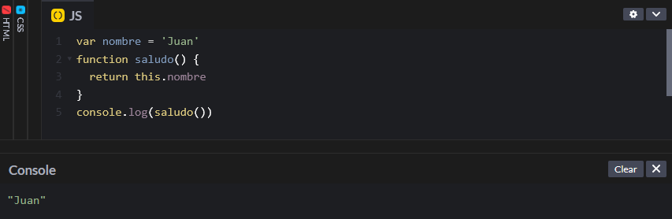
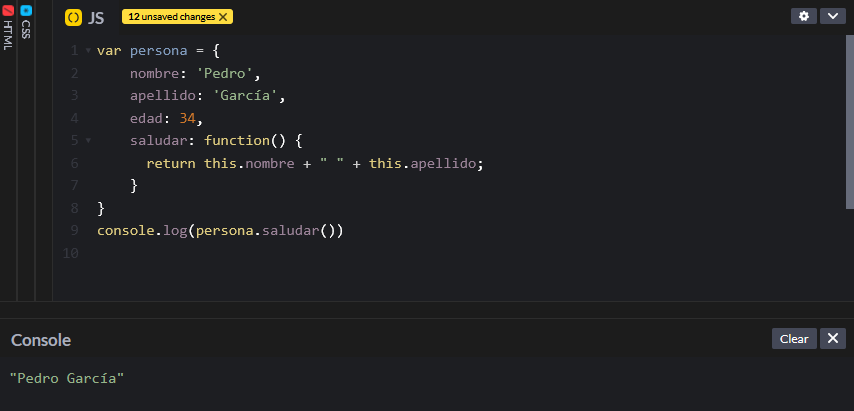
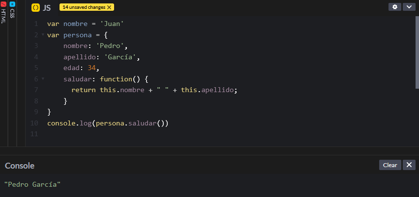
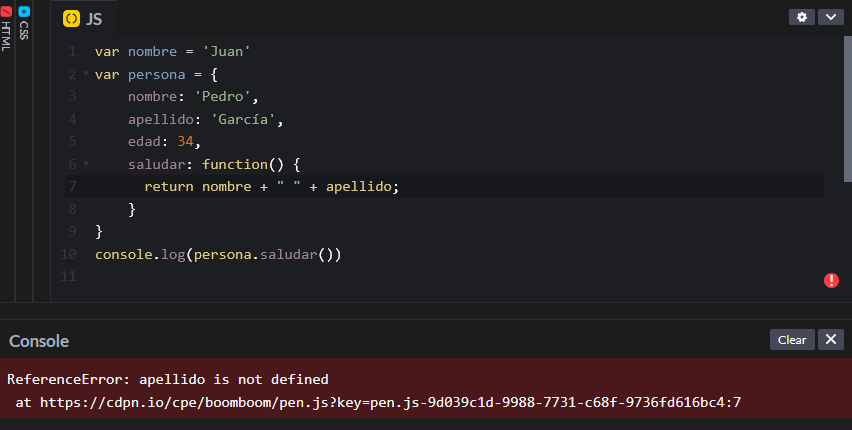

# Palabra clave 'this'

La palabra `this` es una palabra clave que hace referencia a objetos. Sin embargo, funciona de forma diferente en función de cómo se utilice. Algunos de sus usos son para acceder a variables globales desde una función y para acceder a variables que están en un objeto desde una función que se encuentra en el mismo objeto.

### Variables globales

Si se utiliza la palabra `this` dentro de una función, hace referencia e una variable global. Por ejemplo,&#x20;

```javascript
var nombre = 'Juan'
function saludo() {
    return this.nombre
}
console.log(saludo())
```

En este caso, no es necesario crear la variable nombre dentro de la función, sino que utilizando `this`, la función tiene acceso a la variable 'nombre', que es global. Si no utilizamos la palabra `this`, la función no tendrá acceso al nombre, ya que es una variable declarada fuera de la función.

<figure><figcaption></figcaption></figure>

### Funciones dentro de objetos

En este caso se utiliza para hacer referencia a variables que se encuentran dentro del mismo objeto que la función.

```javascript
var persona = {
    nombre: 'Pedro',
    apellido: 'García',
    edad: 34,
    saludar: function() {
      return this.nombre + " " + this.apellido;
    }
}
console.log(persona.saludar())
```

En la función saludar, queremos hacer referencia a variables que se encuentran en el mismo objeto.&#x20;

<figure><figcaption></figcaption></figure>

Si creamos una variable de nombre 'nombre' fuera del objeto, observamos que la función sigue cogiendo el nombre que está en el objeto y no el nombre que está fuera del objeto.&#x20;

<figure><figcaption></figcaption></figure>

Además, si no utilizamos la palabra clave `this`, la función no tiene acceso el nombre y apellido, por lo que da un error. Las variables 'nombre' y 'apellido' están sin definir al no estar definidas dentro de la función.

<figure><figcaption></figcaption></figure>
